<a name="HOLTitle"></a>
# Microsoft Language Understanding Intelligent Service (LUIS) #

---

<a name="Overview"></a>
## Overview ##

One of the key challenges in the world of human-computer interactions is training a computer to discern a user's intent from natural-language commands. Suppose that a user types "find news about Microsoft" into a news reader or browser. A person understands this command easily. But implementing the logic for a computer to understand this simple phrase is an exceedingly difficult task, especially when you factor in language and culture and the influence that those have on how we communicate.  


 
Microsoft's [Language Understanding Intelligent Service](https://www.microsoft.com/cognitive-services/en-us/language-understanding-intelligent-service-luis), or LUIS for short, is designed to fill this need, offering a fast and effective way to add language understanding to applications. LUIS lets you create models that take sentences or *utterances* and interpret them by discerning *intents* such as "find news" and extracting *entities* such as "Microsoft". LUIS utilizes interactive machine-learning techniques and benefits from extensive research on language understanding performed by researchers at Microsoft Research and other institutions. And once a LUIS model is built and trained, it is easily deployed as a Web service so bots and other applications can call it to convert commands entered by users into actions.

In this lab, you will create a LUIS application, configure a language-understanding model using both pre-built and custom entities, and define intents.

<a name="Objectives"></a>
### Objectives ###

In this hands-on lab, you will learn how to:

- Create a LUIS application
- Define intents and entities
- Use pre-built entities and phrase lists
- Train a LUIS model and publish it to an HTTP endpoint

<a name="Prerequisites"></a>
### Prerequisites ###

The following are required to complete this hands-on lab:

- A Microsoft account. If you don't have one, [sign up for free](https://account.microsoft.com/account).
- Microsoft [Visual Studio Code](http://code.visualstudio.com) version 1.7.0 or higher
- Internet Explorer 10 or higher or [Google Chrome](https://www.google.com/chrome/) 

---

<a name="Exercises"></a>
## Exercises ##

This hands-on lab includes the following exercises:

- [Exercise 1: Create a LUIS application](#Exercise1)
- [Exercise 2: Configure intents and entities](#Exercise2)
- [Exercise 3: Add pre-built entities and phrase lists](#Exercise3)
- [Exercise 4: Publish the model to an HTTP endpoint](#Exercise4)
 
Estimated time to complete this lab: **30** minutes.

<a name="Exercise1"></a>
## Exercise 1: Create a LUIS application ##

The first step in creating an intelligent language model with LUIS is to provision an application in the [LUIS portal](https://www.luis.ai/). In order to use the portal, you must run it in Internet Explorer or Google Chrome. If you do not have one of these browsers available, stop now and [install Chrome](https://www.google.com/chrome/).

1. Open the [LUIS portal](https://www.luis.ai/) in Internet Explorer or Chrome. If you aren't already signed in, click **Sign in or create an account** and sign in with your Microsoft account. If you are prompted to "let this app access your info," review the permissions requested and click **Yes**. Additionally, if you are prompted to provide additional details such as the country you live in and the company you work for, fill in the information and click **Continue**.	

    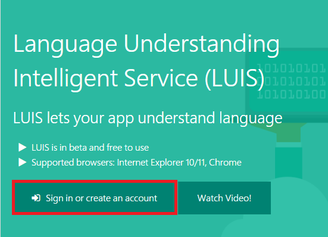

    _Signing in to LUIS_
 
1. Click **+ New App**, and then select **New Application**. 

    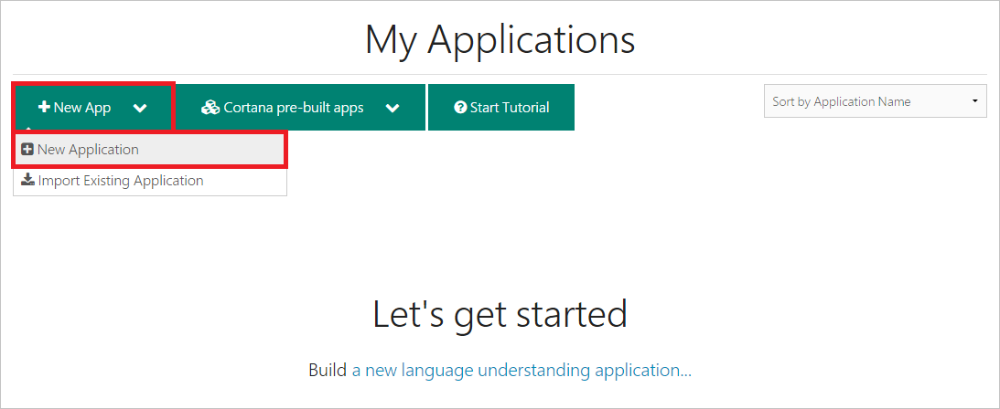

    _Creating a LUIS application_
 
1. In the ensuing dialog, enter "Newsy" (without quotation marks) as the application name and select **Bot** as the usage scenario. Check the **News & Magazines** box and click the **Add App** button. 

    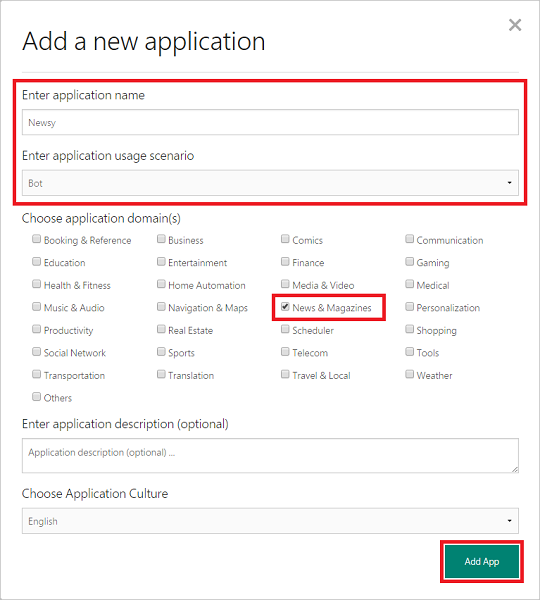

    _Entering information about the application_
 
Your LUIS application is now provisioned and you are ready to start configuring it by adding intents and entities.

<a name="Exercise2"></a>
## Exercise 2: Configure intents and entities ##

In the language of LUIS, **intents** represent actions such as "search" or "find," while **entities** describe target for intents. In this exercise, you will create a simple intent for searching the news and an entity to specify the type of news to search for, such as "soccer" or "Microsoft Surface."

1. Click **+** to the right of "Intents" to add an intent.

    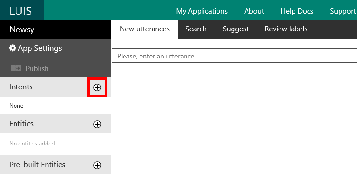

    _Adding an intent_
 
1. Enter "SearchNews" (without quotation marks) for the intent name, and type "Find soccer news" (again, without quotation marks) into box below. The latter is an example of an *utterance*, which is a command that triggers an intent. Then click the **Save** button.

    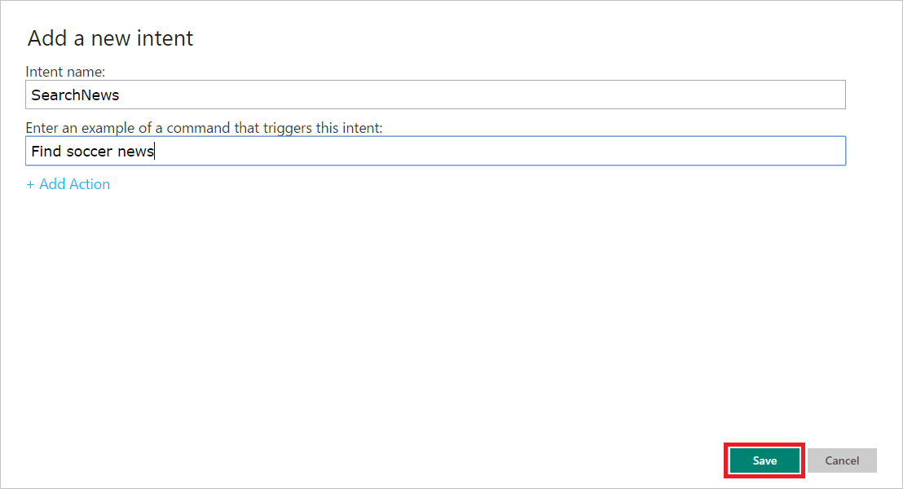

    _Defining an intent_

1. Click **+** to the right of "Entities" to add an entity.

    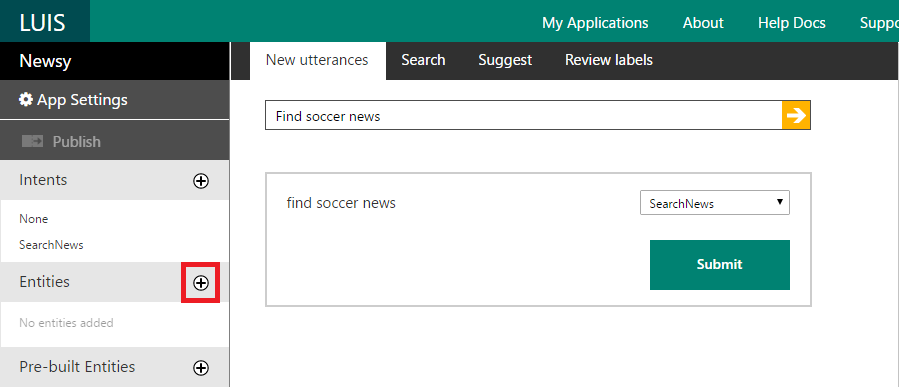

    _Adding an entity_ 

1. Enter "NewsCategory" as the entity name. Then click the **Save** button.
 
    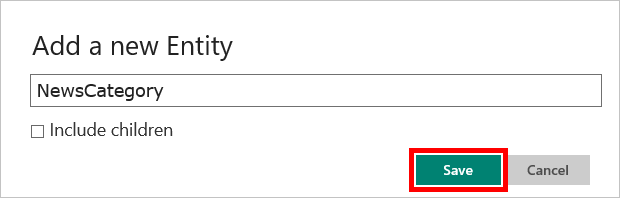

    _Defining an entity_ 

1. To connect the NewsCategory entity to the SearchNews intent, click the word "soccer" and select **NewsCategory** from the popup menu. Then click the **Submit** button.
 
    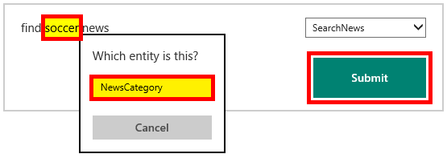

    _Connecting an entity to an intent_

	The phrase "Find soccer news" is now associated with the SearchNews intent, and LUIS will understand the word “soccer” as the target of your action. In order for LUIS to train the model successfully, it needs a few more sample utterances.
	
1. Type "Get soccer news" into the box in the "New utterances" panel and click the **arrow**.
 
    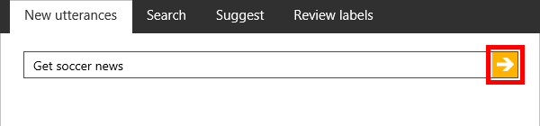

    _Adding an utterance_	 

1. Select **SearchNews** from the drop-down list of intents.

    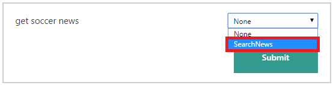

    _Selecting an intent_	 

1. Click the word "soccer" and select **NewsCategory** from the popup menu. Then click the **Submit** button.
 
    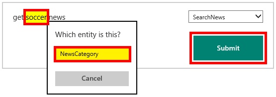

    _Configuring an utterance_

1. Repeat steps 6 through 8, making certain you select **SearchNews** from the intent drop-down, with the following sample phrases (without quotation marks) to populate your LUIS application with information to properly train the model:

	- "Get motorcycle news"
	- "Find motorcycle news"
	- "Get tornado news"
	- "Find tornado news"

1. Review the utterances you have defined by clicking **Review labels** and selecting **Show all labeled utterances** from the drop-down list. Confirm that all entries are assigned to the SearchNews intent and have a yellow-highlighted entity.
 
    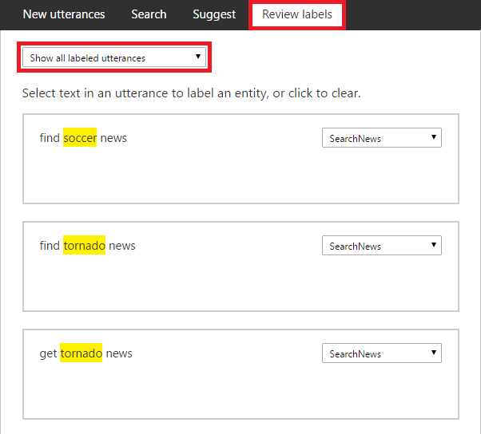

    _Reviewing labeled utterances_

1. Click **Train** in the lower-left corner of the page. After a few seconds, the message "Last train completed" will appear. 
 
    

    _Training a LUIS model_

Your LUIS application is now configured to understand phrases such as "Get soccer news" and to discern that the user wants to search news for the term "soccer." LUIS is smart enough now to know that a phrase such as "Find hockey news" also represents an intent to search news, but for news regarding hockey even though you haven't explicitly trained the model with that term. Your LUIS model is now ready to be configured to support more advanced scenarios, such as identifying terms from a specific list of news categories.

<a name="Exercise3"></a>
## Exercise 3: Add pre-built entities and phrase lists ##

Now that LUIS understands some basic intents and phrases, it's time to make the model even more intelligent by leveraging pre-built entities and phrase lists. Pre-built entities allow a model to know, for example, that words such as "tomorrow" and "September 30" that appear in an entity represent dates and times, or that "20 years old" represents an age. A complete list of the pre-built entities that LUIS supports can be found at https://www.microsoft.com/cognitive-services/en-us/LUIS-api/documentation/Pre-builtEntities. In this exercise, you will add the pre-built *encyclopedia* entity to your intents, and add a phrase list for refining news results by category.

1. Click **+** to the right of "Pre-built Entities" to display a list of pre-built entities.
 
    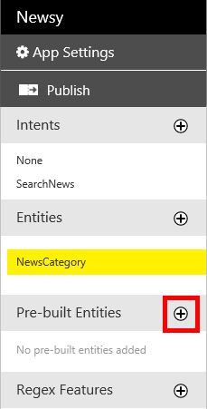

    _Showing pre-built entities_ 

1. Scroll down and select **encyclopedia**. Then click the **OK** button. A new pre-built entity named "encyclopedia" will be added to the list.
 
    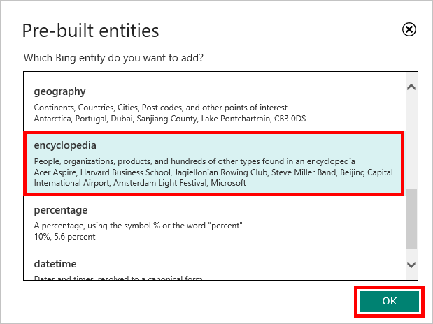

    _Adding the encyclopedia entity_ 

1. Click **+** to the right of "Phrase List Features" to add a new phrase list.
 
    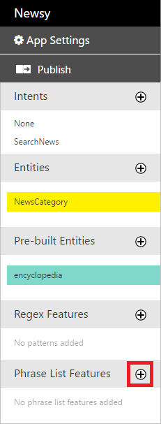

    _Adding a phrase list_ 

1. Type "NewsCategory" (without quotation marks) for the feature name. Enter the comma-delimited list below, and then click the **Save** button.

	```
	Business,Entertainment,Health,Politics,ScienceAndTechnology,Sports,US,World 
 	```

    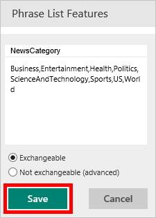

    _Saving the phrase list_ 
 
Your LUIS model has now been enhanced with a pre-built entity and a phrase list, and can understand most typical phrases relating to finding news based on various terms. Let's see how LUIS interprets this information and publish the model to make it available for use.

<a name="Exercise4"></a>
## Exercise 4: Publish the model to an HTTP endpoint ##

In this exercise, you will publish the model to an HTTP endpoint so it can be accessed by applications that wish to incorporate language understanding. Before proceeding, be certain that you trained the model in the last step in the previous exercise. If you did not train it, train it now.

1. Click **Publish**.
 
    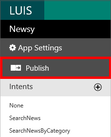

    _Publishing the model_
 
1. Click the **Publish web service** button. 
 
    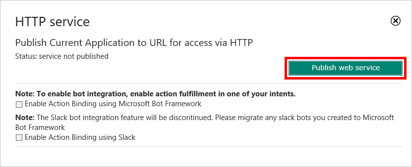

    _Publishing to an HTTP endpoint_

1. After a short delay, the dialog will expand and show an interface for entering queries, calling the HTTP endpoint, and viewing query results. Type "Find Super Bowl news" into the "Query" box and then click the link below to test the query.
 
    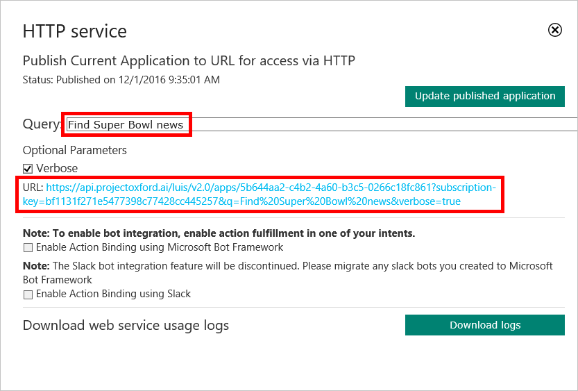

    _Testing the query_
	
1. This calls the HTTP endpoint and displays the JSON data that is returned. Observe that LUIS identified "super bowl" as the entity and determined that "SearchNewsByCategory" was the most likely intent:

	```JSON
	{
	  "query": "Find Super Bowl news",
	  "topScoringIntent": {
	    "intent": "SearchNewsByCategory",
	    "score": 0.414106578,
	    "actions": [
	      {
	        "triggered": false,
	        "name": "SearchNewsByCategory",
	        "parameters": [
	          {
	            "name": "NewsCategory",
	            "type": "NewsCategory",
	            "required": true,
	            "value": null
	          }
	        ]
	      }
	    ]
	  },
	  "intents": [
	    {
	      "intent": "SearchNewsByCategory",
	      "score": 0.414106578,
	      "actions": [
	        {
	          "triggered": false,
	          "name": "SearchNewsByCategory",
	          "parameters": [
	            {
	              "name": "NewsCategory",
	              "type": "NewsCategory",
	              "required": true,
	              "value": null
	            }
	          ]
	        }
	      ]
	    },
	    {
	      "intent": "SearchNews",
	      "score": 0.131110832,
	      "actions": [
	        {
	          "triggered": true,
	          "name": "SearchNews",
	          "parameters": [
	            {
	              "name": "Encyclopedia",
	              "type": "encyclopedia",
	              "required": false,
	              "value": null
	            }
	          ]
	        }
	      ]
	    },
	    {
	      "intent": "None",
	      "score": 0.04309769
	    }
	  ],
	  "entities": [
	    {
	      "entity": "super bowl",
	      "type": "builtin.encyclopedia.time.event",
	      "startIndex": 5,
	      "endIndex": 14,
	      "score": 0.9727775
	    }
	  ],
	  "dialog": {
	    "prompt": "Please specify a category",
	    "parameterName": "NewsCategory",
	    "parameterType": "NewsCategory",
	    "contextId": "dc4c0b11-95b1-463f-8251-2b7e59253ee9",
	    "status": "Question"
	  }
	}
	```

1. Click the **X** in the upper-right corner of the dialog to close the dialog.

Now that the model is available over HTTP, you can call it from an application and incorporate the model's intelligence in the application.

<a name="Summary"></a>
## Summary ##

In this hands-on lab you learned how to:

- Create a LUIS application
- Define intents and entities
- Use pre-built entities and phrase lists
- Train a LUIS model and publish it to an HTTP endpoint

There is much more that you can do to leverage the power of the Microsoft Language Understanding Intelligent Services in your code. For starters, try experimenting with other LUIS features such as [intent dialogs](https://docs.botframework.com/en-us/node/builder/chat/IntentDialog/#navtitle) and adding more pre-built entities to your model. For additional background on LUIS and examples of how to use it, refer to https://docs.botframework.com/en-us/node/builder/guides/understanding-natural-language/.

----

Copyright 2016 Microsoft Corporation. All rights reserved. Except where otherwise noted, these materials are licensed under the terms of the MIT License. You may use them according to the license as is most appropriate for your project. The terms of this license can be found at https://opensource.org/licenses/MIT.